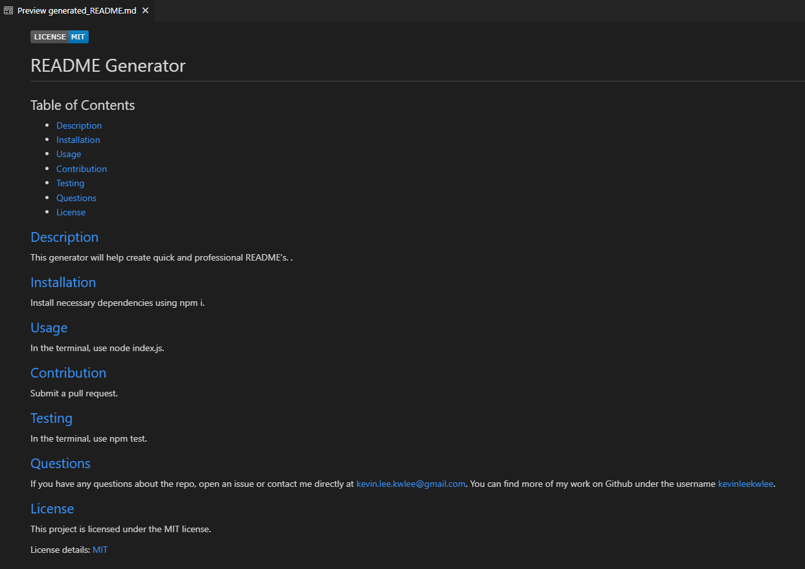

# README Generator

## Description
This repository contains an application that utilizes inquirer and fs to generate quick and professional README markdown documents. README documents are often left out from projects despite being such a vital piece of the puzzle, especially for new audiences. This application will simplify the README creation process and provide structure to ensure complete and ready README's.   

## Usage

Through the terminal, install the required tools using the following: 

```
npm i
```

Through the terminal, initialize the application using the following:

```
node index.js
```

Video demo: https://drive.google.com/file/d/1N3CMc3H40ntVTSoB974PnKZz96snR4lB/view?usp=sharing

Below is a screenshot of the website. 

